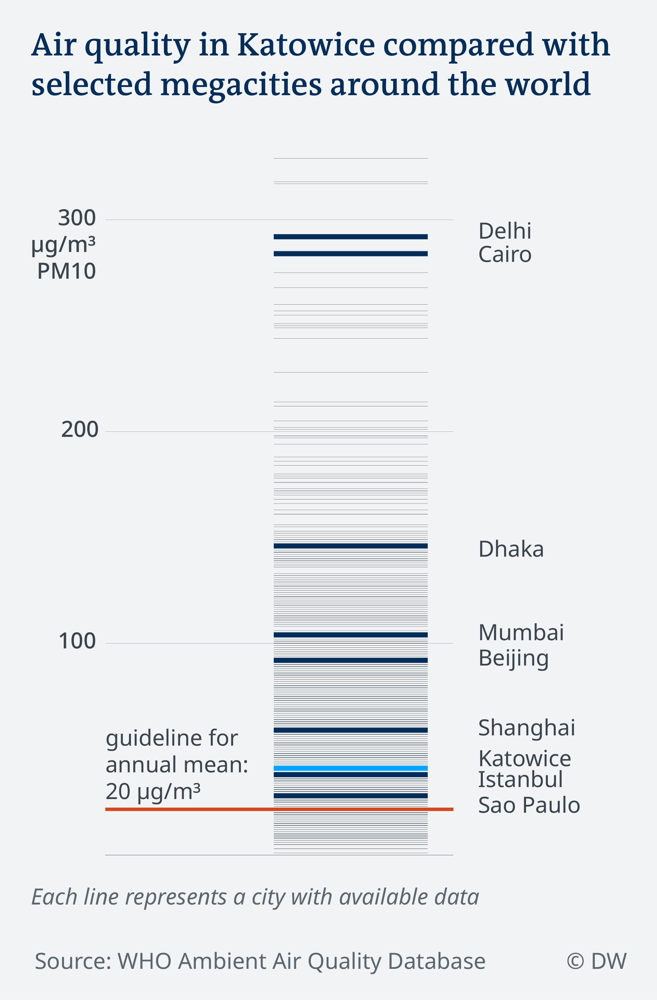

# How does the air in Katowice compare to cities around the world?

An extension to the article ["Where is Europe's air safe to breathe?"](https://www.dw.com/en/where-is-europes-air-safe-to-breathe/a-46189571)

### Data source

[WHO Global Ambient Air Quality Database](http://www.who.int/airpollution/data/cities/en/), downloaded 30.10.2018.

### Methodology

Data used for this visual:
- Indicator: PM10 Annual Mean
- Unit: ug/m3
- Time: Latest available measurement for each city

Visualized with R using the tidyverse packages.

### Output

